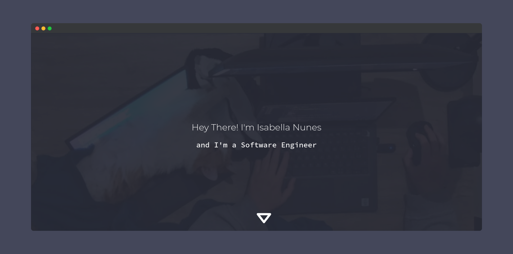

# isadfrn.dev

## Resources

- [HTML](https://developer.mozilla.org/pt-BR/docs/Web/HTML)
- [CSS](https://developer.mozilla.org/pt-BR/docs/Web/CSS)

## Content language

- English

## About

A portfolio page.

## Run

Install [Live Server extension](https://marketplace.visualstudio.com/items?itemName=ritwickdey.LiveServer), right click on `index.html` file on [client directory](./client/) and then click on `Open with Live Server`.

## Contributing

- Fork this repository;
- Clone to your machine;
- Create a branch like:
  - `feature/description`
  - `bugfix/description`
- Commit your code;
- Submit a pull request and wait until is reviewed;

## Status

Always in progress 🚧

## License

[MIT](./LICENSE)
