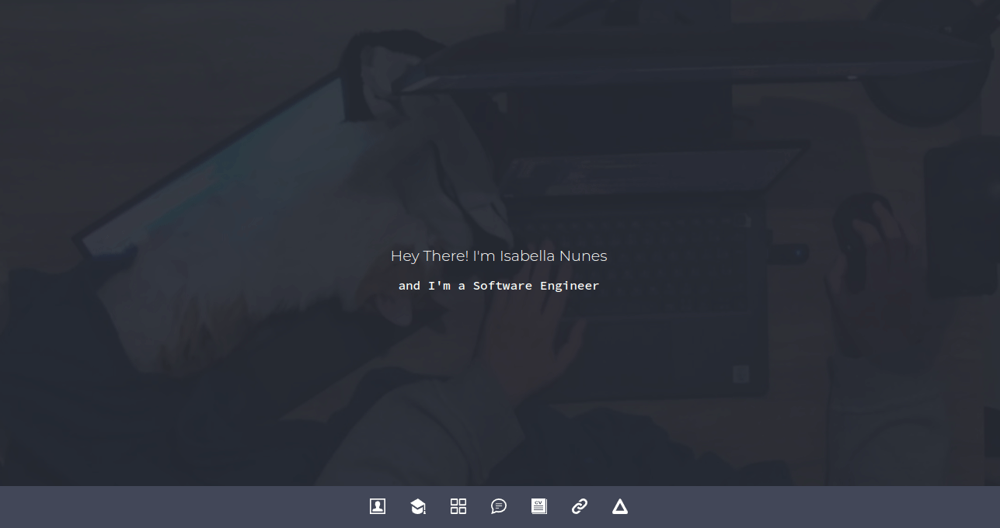

# My personal portfolio

## About

My personal portfolio page.

## Status

Maintaining ✅

## Run

For this projet run `npm install` on root directory for installing all dependencies, then `npm run dev` and access http://127.0.0.1:3000/ on your browser.

## License

[MIT](./LICENSE)
